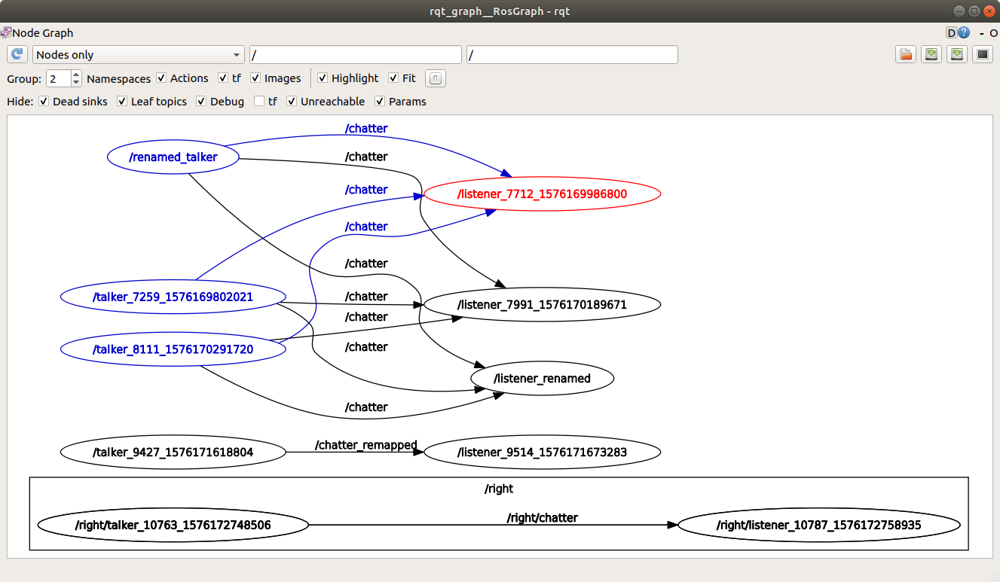

# TUTORIAL - BASIC RUN NODES, RENAME, AND RQT_GRAPH

```
# terminal
source /opt/ros/melodic/setup.bash
roscore

# terminal
source /opt/ros/melodic/setup.bash
rosrun rospy_tutorials talker

# terminal
source /opt/ros/melodic/setup.bash
rosrun rospy_tutorials listener

# terminal
source /opt/ros/melodic/setup.bash
rqt_graph

# terminal
source /opt/ros/melodic/setup.bash
rosrun rospy_tutorials talker
# refresh RQT

# terminal
source /opt/ros/melodic/setup.bash
rosrun rospy_tutorials listener
# refresh RQT
```

NOTE
/opt/ros/melodic/share/rospy_tutorials/001_talker_listener/talker.py
-pub = rospy.Publisher('chatter', String, queue_size=10)
	'chatter' is the name of the topic
-rospy.init_node('talker', anonymous=True) 
	ANONYMOUS adds a random number to the end of your node's name, to make it unique
-pub.publish(hello_str)
	publishes topic!!

NOTE
/opt/ros/melodic/share/rospy_tutorials/001_talker_listener/listener.py
-rospy.init_node('listener', anonymous=True)
-rospy.Subscriber('chatter', String, callback)
	will listen to any topic 'chatter'
	NO matter where it comes from (there is NO need to name the source node!!!, just the topic)
	NO matter if there are multiple sources

TOPIC RENAME ('REMAPPING')
```
# terminal
source /opt/ros/melodic/setup.bash
rosrun rospy_tutorials talker chatter:=chatter_remapped
# refresh RQT

# terminal
source /opt/ros/melodic/setup.bash
rosrun rospy_tutorials listener chatter:=chatter_remapped
# refresh RQT
```

NAMESPACE
```
# terminal
source /opt/ros/melodic/setup.bash
rosrun rospy_tutorials talker __ns:=right
# refresh RQT

# terminal
source /opt/ros/melodic/setup.bash
rosrun rospy_tutorials listener __ns:=right
# refresh RQT
```

NODE RENAME
```
# terminal
source /opt/ros/melodic/setup.bash
rosrun rospy_tutorials talker __name:=talker_renamed
# refresh RQT

# terminal
source /opt/ros/melodic/setup.bash
rosrun rospy_tutorials listener __name:=listener_renamed
# refresh RQT
```





